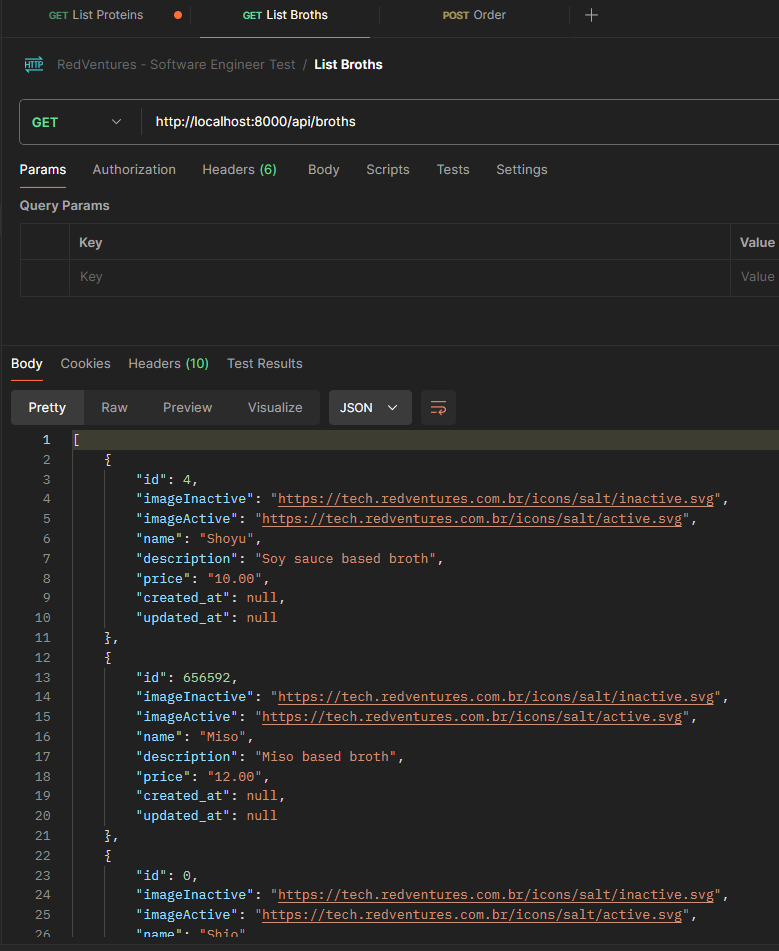
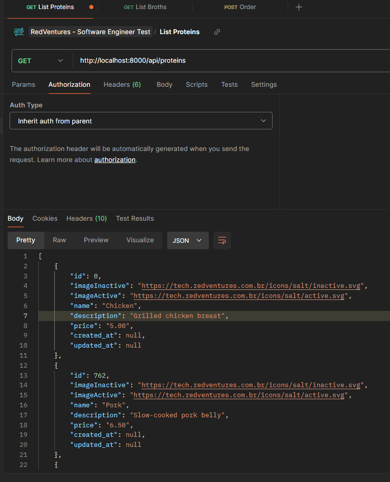
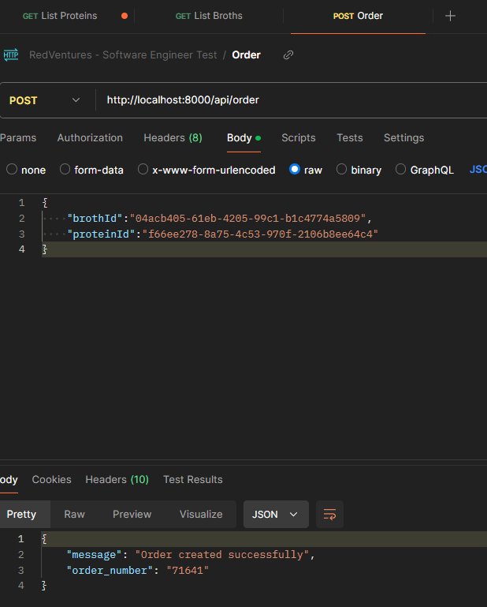
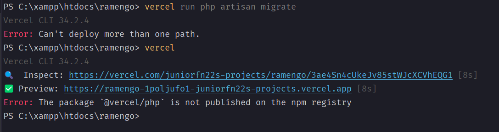

 Teste Técnico Red Ventures - RamenGO

## Considerações
Todo o processo de código foi relativamente simples, utilizei as migrations do laravel pra montar as tabelas.
Usei os Models dentro dos controllers pra trazer os dados nos endpoint de "Broths" e "Proteins".
Fiz a requisição pra api para obter o ORDER NUMBER.

### Broths

### Proteins

### Order Number

## Problemas 

Tive dificuldade no deploy para a vercel, primeiro alguns problemas referente ao vercel.json e o pacote do php que não estava sendo localizado:

### @vercel/php

Tentei remover essa parte do vercel json e ele seguiu com o deploy, porém não rodou as migrations no banco de dados.

## Considerações finais

Achei o desfio bastante interessante, a parte do código não foi de todo desafiador, montar essa lógica é relativamente
simples já que é um problema bem tranquilo de se resolver. Não tenho muita experiência com deploys de aplicação na vercel/railway
mas gostei bastante e pretendo finalizar esse teste futuramente. 
Demorei um pouco pra iniciar ele devido às demandas do dia-a-dia, e acabei por iniciar ele ontem (03/06/2024) e conclui no dia seguinte.
Um pouco em cima eu sei, creio que se tivesse iniciado antes teria completado ele 100%.
No mais gostaria de agradecer a oportunidade de fazer o teste e dizer que seria um prazer evoluir mais junto a Red.
